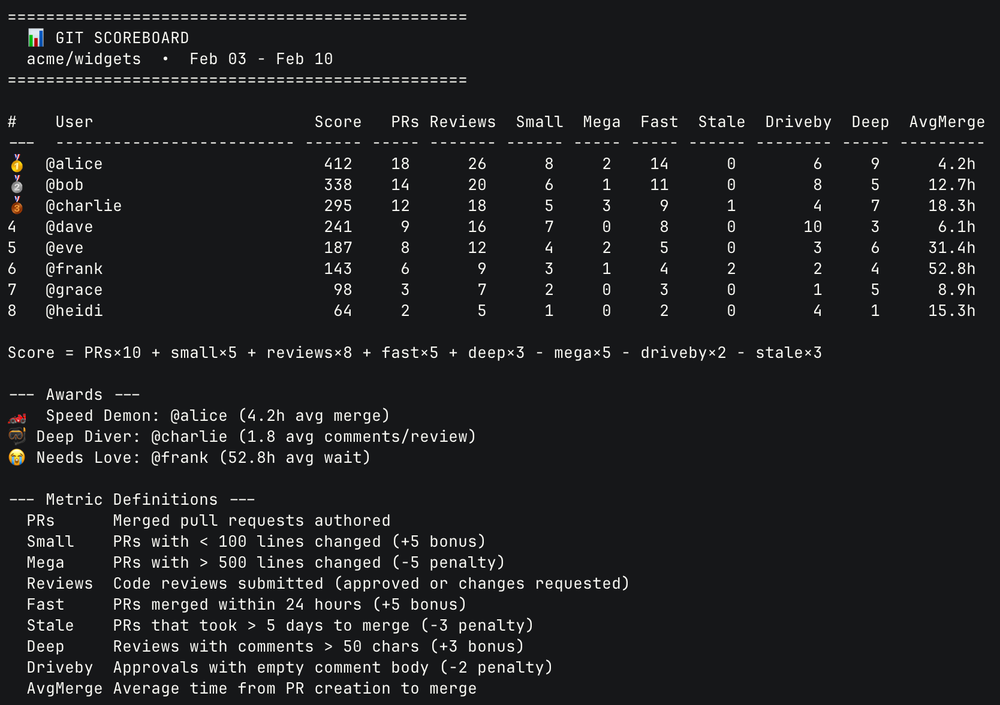

# git-scoreboard

A weekly contributor leaderboard for GitHub repos. Tracks PRs, reviews, velocity, and code quality signals to generate a scored ranking of contributors.



## Install

```bash
# Clone and add to PATH
git clone https://github.com/kschrader/git-scoreboard.git
export PATH="$PATH:$(pwd)/git-scoreboard"

# Or just copy the script
curl -o /usr/local/bin/git-scoreboard.sh \
  https://raw.githubusercontent.com/kschrader/git-scoreboard/main/git-scoreboard.sh
chmod +x /usr/local/bin/git-scoreboard.sh
```

## Requirements

- [GitHub CLI](https://cli.github.com/) (`gh`) - authenticated
- `jq` - JSON processor
- `bash` 4+

## Usage

```bash
# Run in any GitHub repo - auto-detects from git remote
git-scoreboard.sh

# Specify time window (days)
git-scoreboard.sh 14

# Explicit repo(s)
git-scoreboard.sh 7 owner/repo
git-scoreboard.sh 7 owner/repo1 owner/repo2 owner/repo3

# Monorepo with submodules - auto-detects all submodule remotes
cd my-monorepo
git-scoreboard.sh
```

## Auto-detection

When no repos are passed as arguments, `git-scoreboard.sh` detects what to scan:

1. **Submodules**: If `.gitmodules` exists, extracts GitHub remotes from all submodules
2. **Current repo**: Falls back to the current repo's `origin` remote

## Scoring Formula

```
Score = PRs×10 + small×5 + reviews×8 + fast×5 + deep×3 - mega×5 - driveby×2 - stale×3
```

| Metric | Definition | Effect |
|--------|-----------|--------|
| PRs | Merged pull requests authored | +10 each |
| Small | PRs with < 100 lines changed | +5 bonus |
| Mega | PRs with > 500 lines changed | -5 penalty |
| Reviews | Code reviews (approved or changes requested) | +8 each |
| Fast | PRs merged within 24 hours | +5 bonus |
| Stale | PRs that took > 5 days to merge | -3 penalty |
| Deep | Reviews with comments > 50 chars | +3 bonus |
| Driveby | Approvals with empty comment body | -2 penalty |

## Awards

- **Speed Demon** - Fastest average merge time (min 2 PRs)
- **Deep Diver** - Most thorough reviewer by avg comment length (min 2 reviews)
- **Needs Love** - Longest average wait for PR merge

## Inspiration

Inspired by [this tweet](https://x.com/michlimlim/status/2021270095281127525) from [@michlimlim](https://x.com/michlimlim) showing Flint Bot's Git Scoreboard.

## License

MIT
